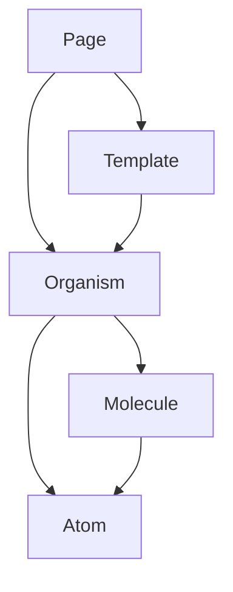

# 飞手管家项目架构手册 (Project Architecture Manual)

本项目采用 **Atomic Design (原子设计)** 模式进行组件化开发，旨在提高代码的复用性、可维护性和视觉一致性。

## 1. 架构核心概念

我们将 UI 划分为五个层级：
- **Atoms (原子)**: 最基础的 UI 单元（如：图标、徽章、状态点、动画数字）。
- **Molecules (分子)**: 由原子组成的简单功能单元（如：指标卡、告警项、导航项）。
- **Organisms (生物)**: 复杂的 UI 区块，由分子 and 原子组成（如：页头、地图容器、告警面板、功能弹窗）。
- **Templates (模板)**: 定义页面排版的容器，通常通过 props 或 slots 接收 Organisms。
- **Pages (页面)**: 最终交付的视图，注入真实/模拟数据并组合模板与生物。

---

## 2. 组件清单 (Component Inventory)

### 2.1 Pages (页面)
页面是系统的顶层视图，负责业务逻辑所在的聚合。
- `RealTimePage.vue`: 实时监控页面 (核心功能：实时地图、在飞统计、实时告警看板)
- `ScreenPage.vue`: 可视化大屏 (核心功能：无人机告警统计、违规排名、实时起降监控)
- `HistoryRecordPage.vue`: 历史记录查询
- `AnalyseCenterPage.vue`: 违章行为分析中心
- `SettingsPage.vue`: 系统配置与管理
- `LoginPage.vue`: 用户登录页面

### 2.2 Templates (模板)
模板决定了页面的骨架。
- `LayoutMain.vue`: 基础管理布局 (包含顶栏 `DsHeader` 和主体内容区)
- `LayoutFullscreen.vue`: 全屏布局 (用于大屏展示)
- `PageTableView.vue`: 标准列表页模板 (包含面包屑、筛选栏、表格区)

### 2.3 Organisms (生物)
具有独立业务意义的复杂模块。
- **全局类**: `DsHeader.vue` (顶部导航), `DsSidebar.vue` (侧边菜单)
- **地图类**: `DsMapContainer.vue` (核心地图容器, 基于高德地图), `DsLocationMapModal.vue`, `DsLocationPickerModal.vue`
- **业务看板**: `DsAlertFeed.vue` (实时告警流), `DsStatDashboard.vue` (统计看板)
- **特定业务弹窗**: `DsNoFlyZoneModal.vue` (禁飞区管理), `DsRealtimeActivityModal.vue`, `DsScheduledActivityModal.vue`
- **展示类**: `DsChartCard.vue` (通用图表包装容器, 含标题与工具栏)

### 2.4 Molecules (分子)
高度复用的功能性组件。
- **卡片类**: `DsTrendCard.vue` (带趋势图的指标卡), `DsHudCard.vue` (大屏 HUD 风格卡片), `DsMetricCard.vue` (业务指标项), `DsStatCard.vue`
- **导航类**: `DsHeaderBrand.vue` (品牌标识), `DsHeaderNavItem.vue` (导航菜单项), `DsHeaderTimePanel.vue` (页头时间显示)
- **交互类**: `DsFilterBar.vue` (通用筛选条), `DsTableActions.vue` (表格操作列), `DsMapLayerControl.vue` (地图图层 HUD 控制器)
- **业务类**: `DsAlertItem.vue` (告警列表条目), `DsRealtimeAlertBanner.vue` (实时告警横幅), `DsMapInfoWindow.vue` (地图信息窗体)
- **展示类**: `DsRankList.vue` (排行榜), `DsChartCard.vue` (专用折线图实现), `DsSparkline.vue` (迷你趋势图)

### 2.5 Atoms (原子)
最基础的视觉元素。
- **状态与修饰**: `DsGlowDot.vue` (呼吸光点), `DsToken.vue` (状态标签), `DsTrend.vue` (涨跌趋势箭头)
- **数据展示**: `DsStatNumber.vue` (动态翻牌器/数字显示), `DsTimestamp.vue` (格式化时间), `DsDeviceId.vue` (设备ID展示)
- **基础组件**: `DsIcon.vue` (统一图标容器), `DsHudTitle.vue` (HUD 风格标题), `DsGlassTab.vue` (磨砂玻璃页签)

---

## 3. 架构复用关系 (Architecture & Reuse)

### 3.1 引用层次结构
复用关系严格遵循以下金字塔模型：

### 3.2 典型复用模式
1.  **Layout 集成**: `LayoutMain` 模板引用 `DsHeader` (Organism)，各管理页面（如 `HistoryRecordPage`）通过路由注入 `LayoutMain` 的插槽。
2.  **Map Layer 扩展**: `DsMapContainer` 组件作为核心 Organism，被多个业务弹窗（如 `DsNoFlyZoneModal`）和页面（`RealTimePage`）引用，实现了地图功能的逻辑复用。
3.  **统计组件链**: `DsTrendCard` (Molecule) 内部组合了 `DsStatNumber` (Atom)、`DsTrend` (Atom) 和 `DsChartCard` (Molecule)，并广泛应用于 `RealTimePage` 等监控页面。
4.  **HUD 视觉体系**: `DsHudCard` 内部使用 `DsHudTitle`，并作为核心容器承载 `DsRankList` 或 `DsChartCard`。

---

## 4. 样式规范 (Styling Standards)
- **CSS 方案**: 采用原生的 Vanilla CSS 结合 Tailwind CSS 类名（见 `ScreenPage.vue` 中的布局实现）。
- **设计系统**: 基于 `@/design-system` 目录定义的 Token (Colors, Borders, Shadows) 实现科技感/磨砂玻璃视觉效果。
- **图表主题**: ECharts 统一使用 `drone-dark` 科技感主题，配合自定义渲染器 (SVG/Canvas) 优化大屏表现。

---

## 5. 组件依赖与复用统计 (Component Dependencies & Reuse Stats)

### 5.1 Atoms 层级
| 组件名称 | 复用次数 | 核心依赖 |
| :--- | :--- | :--- |
| `DsIcon` | 10+ | - |
| `DsStatNumber` | 8 | - |
| `DsGlowDot` | 5 | - |
| `DsToken` | 4 | - |
| `DsHudTitle` | 4 | - |
| `DsTrend` | 2 | - |

### 5.2 Molecules 层级
| 组件名称 | 复用次数 | 核心依赖 |
| :--- | :--- | :--- |
| `DsHudCard` | 5 | DsHudTitle (atoms) |
| `DsTrendCard` | 2 | DsStatNumber, DsTrend, DsIcon, DsHudTitle (atoms), DsChartCard (molecules) |
| `DsAlertItem` | 2 | - |
| `DsMetricCard` | 2 | DsStatNumber (atoms) |
| `DsHeaderNavItem` | 2 | - |
| `DsMapLayerControl`| 1 | DsIcon (atoms) |
| `DsMapInfoWindow` | 1 | DsGlowDot, DsIcon, DsToken (atoms) |

### 5.3 Organisms 层级
| 组件名称 | 复用次数 | 核心依赖 |
| :--- | :--- | :--- |
| `DsMapContainer` | 6 | - |
| `DsHeader` | 3 | DsHeaderBrand, DsHeaderNavItem, DsHeaderTimePanel (molecules) |
| `DsAlertFeed` | 2 | DsAlertItem (molecules), DsHudTitle (atoms) |
| `DsChartCard` | 2 | - |

### 5.4 Templates 层级
| 组件名称 | 复用次数 | 核心依赖 |
| :--- | :--- | :--- |
| `LayoutMain` | 1 (Router) | DsHeader (organisms) |
| `PageTableView` | 1 | DsFilterBar, DsTableActions (molecules) |
